# <p style="color:RED">Information Gathering </p>

---

## <p style="color:Green">Nmap scan </p> 

```bash
sudo nmap -sC -sV 10.10.10.229 -v
```

```bash
22/tcp   open  ssh              OpenSSH 8.1 (protocol 2.0)
| ssh-hostkey: 
|_  4096 52:47:de:5c:37:4f:29:0e:8e:1d:88:6e:f9:23:4d:5a (RSA)
80/tcp   open  http             nginx 1.17.4
| http-methods: 
|_  Supported Methods: GET HEAD
|_http-server-header: nginx/1.17.4
|_http-title: Site doesn\'t have a title (text/html).
3306/tcp open  mysql            MySQL (unauthorized)
|_ssl-cert: ERROR: Script execution failed (use -d to debug)
|_ssl-date: ERROR: Script execution failed (use -d to debug)
|_sslv2: ERROR: Script execution failed (use -d to debug)
|_tls-alpn: ERROR: Script execution failed (use -d to debug)
|_tls-nextprotoneg: ERROR: Script execution failed (use -d to debug)
8081/tcp open  blackice-icecap?
| fingerprint-strings: 
|   FourOhFourRequest, GetRequest: 
|     HTTP/1.1 200 OK
|     Content-Type: text/plain
|     Date: Sat, 26 Jun 2021 10:57:52 GMT
|     Connection: close
|     Hello World
|   HTTPOptions: 
|     HTTP/1.1 200 OK
|     Content-Type: text/plain
|     Date: Sat, 26 Jun 2021 10:57:58 GMT
|     Connection: close
|_    Hello World

```

We have 4 ports open


---

## <p style="color:Green">Web Enum </p> 

First let's add `spectra.htb` to `/etc/hosts`


```bash
echo "10.10.10.229 spectra.htb" >> /etc/hosts
```

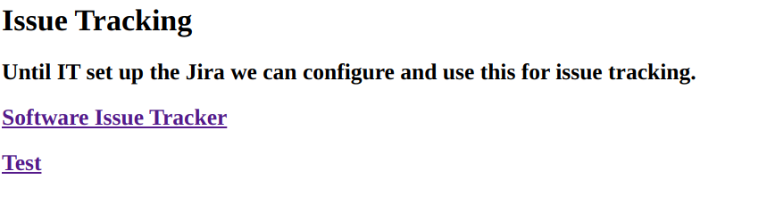

Let's check both of these pages

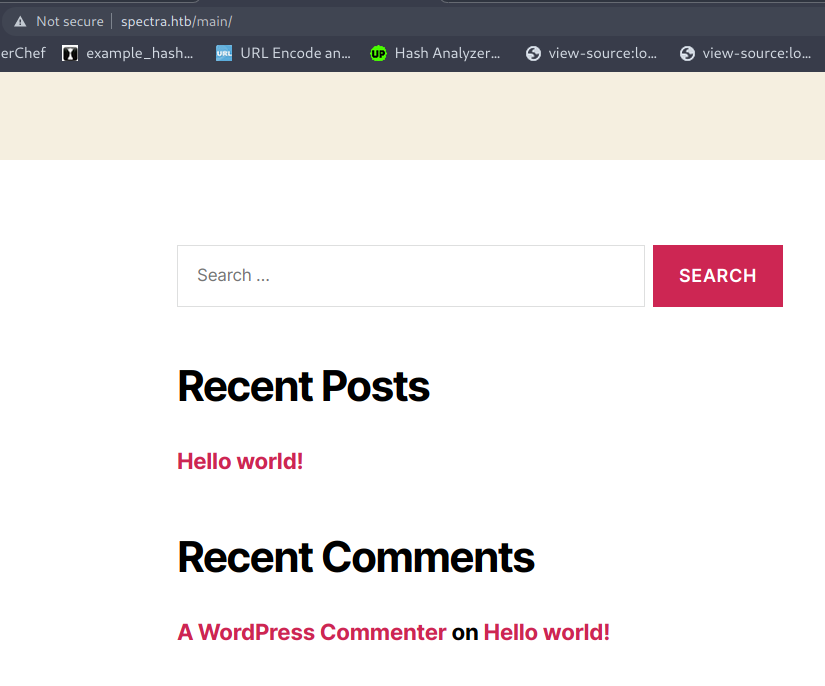

Just a simple wordpress page

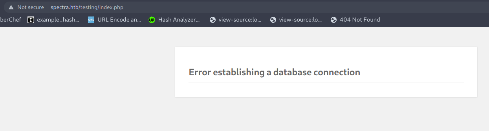

From this error we can know that we're dealing with another wordpress page but it's misconfigured


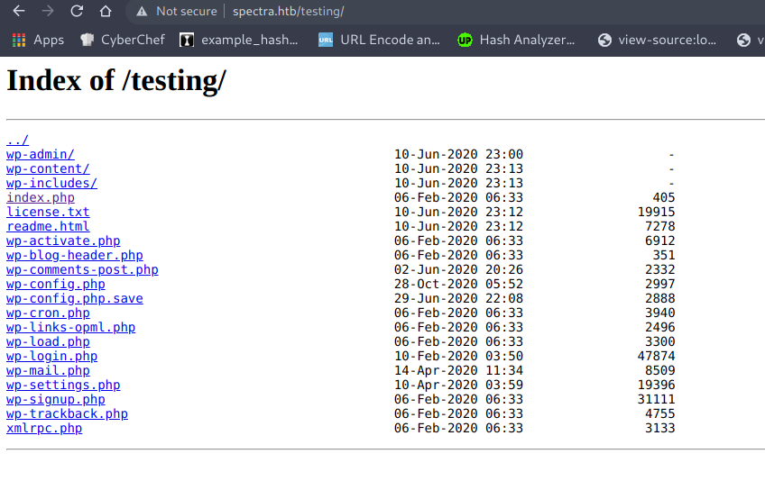

We have also directory listing on `/testing/`


We can see aswell an interesting file `wp-config.php.save` Which seems to be a backup of the original config file


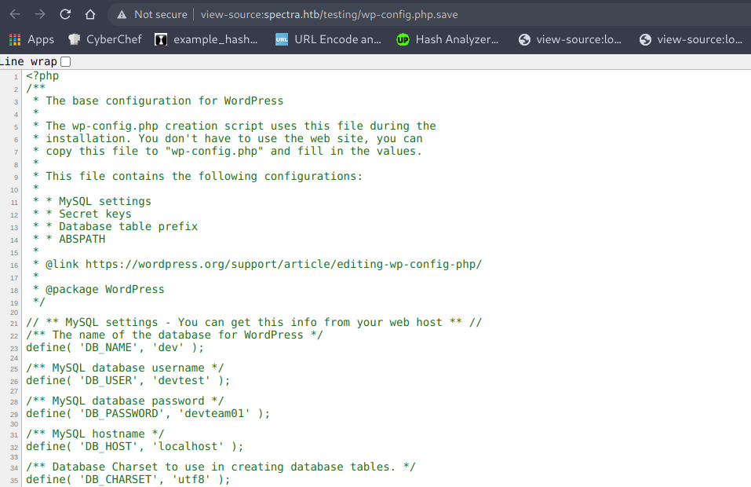


We get credentials

```php

/** MySQL database username */
define( 'DB_USER', 'devtest' );

/** MySQL database password */
define( 'DB_PASSWORD', 'devteam01' );
```

Let's try to login


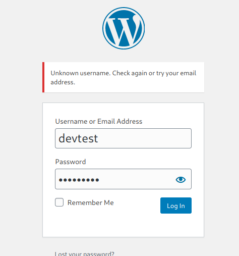

We couldn't login with this username!
This is an easy rated machine, we can manually check if this password works with any default username `admin/administrator` for exemple

- Admin user doesn't exist

- administrator exists ; let's try the password we got 


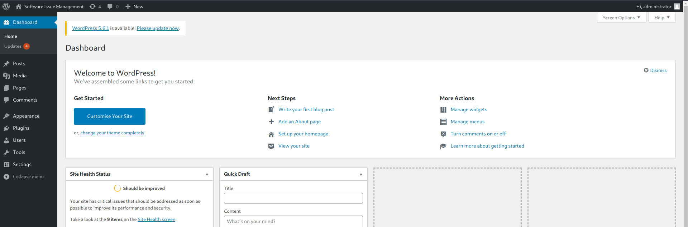

And we're in


# <p style="color:RED">Foothold </p>

---


Let's create our malicious plugin


> I'll use pentestmonkey's php revshell https://github.com/pentestmonkey/php-reverse-shell

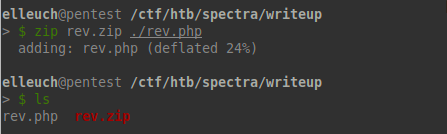

Let's now upload thiss plugin 

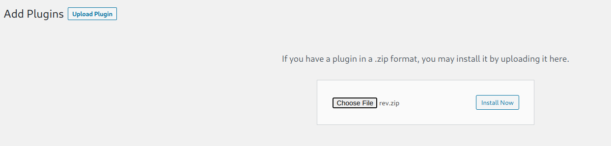


Let's setup a listener and install the plugin


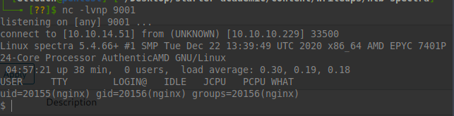

And we're on the box


# <p style="color:RED">User Flag </p>

---

After enumerating a bit, we can see an interesting file in `/opt/`


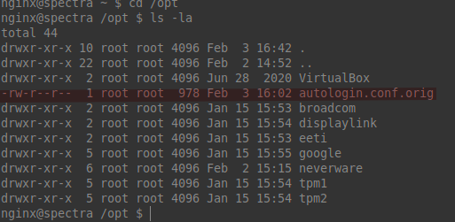

```bash
# Copyright 2016 The Chromium OS Authors. All rights reserved.
# Use of this source code is governed by a BSD-style license that can be
# found in the LICENSE file.
description   "Automatic login at boot"
author        "chromium-os-dev@chromium.org"
# After boot-complete starts, the login prompt is visible and is accepting
# input.
start on started boot-complete
script
  passwd=
  # Read password from file. The file may optionally end with a newline.
  for dir in /mnt/stateful_partition/etc/autologin /etc/autologin; do
    if [ -e "${dir}/passwd" ]; then
      passwd="$(cat "${dir}/passwd")"
      break
    fi
  done
  if [ -z "${passwd}" ]; then
    exit 0
  fi
  # Inject keys into the login prompt.
  #
  # For this to work, you must have already created an account on the device.
  # Otherwise, no login prompt appears at boot and the injected keys do the
  # wrong thing.

```

So as the comment says it's going to get the password from  `/mnt/stateful_partition/etc/autologin/passwd` or `/etc/autologin/passwd`

Let's try both of these

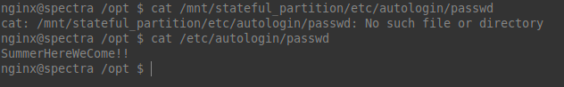

And we get a password!!

we can ssh into the box as the user `katie`

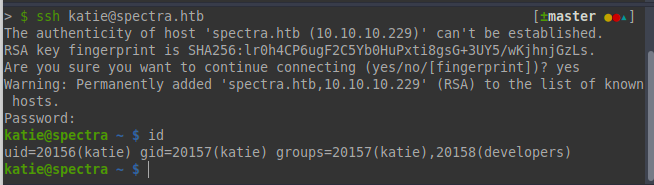

# <p style="color:RED">Root Flag </p>

---

Let's check if we can run anything as root

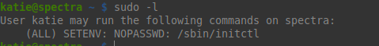


initctl binary own SUDO privileges. This binary allows us to interact with Upstart!

initctl uses the configuration files located at `/etc/init`

The trick is to either create our own config file or inject a malicious code on an existing config file then restart it in order to execute our code


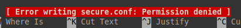

Sadly we don't have write access!

Scrolling a bit in the files we can see that we can edit few files because we're in the `developers` group 

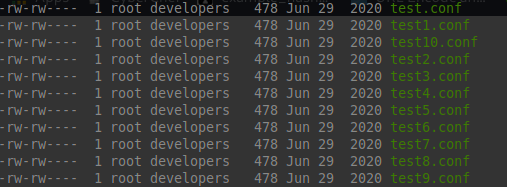


Let's edit one of these

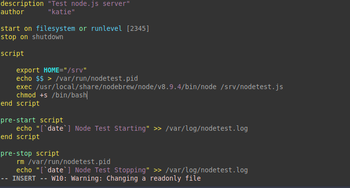

Then we need to start the service
```bash
sudo /sbin/initctl start test
```

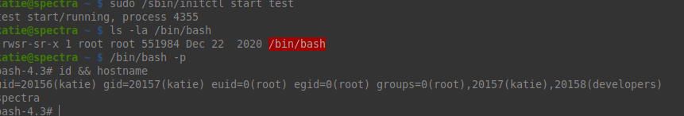

And we rooted the box


## Thanks for reading hope you enjoyed it!


